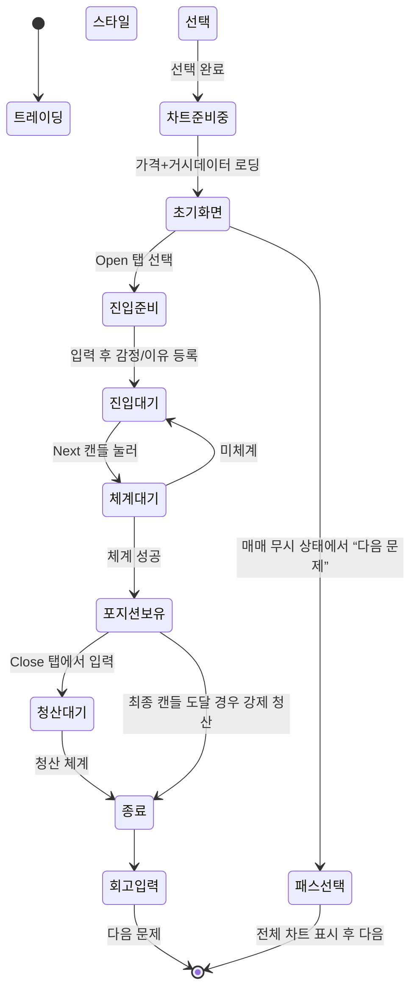

# 📘 ChartTeacher 연습 > 모의투자 시뮬리언 기능 정의서

## 참조 🏗️ 전체 앱 구조

### 메인 메뉴 구성
```
📱 ChartTeacher
├── 🎮 연습 (메인 기능)
│   ├── 모의투자: 전략 선택 → 시뮬레이션 → 회고 흐름
│   └── 스피드 퀴즈: 빠른 반복 훈련 + 버튼식 감정/이유 선택
├── 📚 학습
│   ├── 기술적 분석 이론
│   └── 샘플 문제 + 퀴즈
├── 📂 내 기록
│   ├── 매매 히스토리
│   └── 간단 통계 및 회고 기록 확인
├── 🤖 AI 분석
│   ├── 나만의 규칙 (Fake AI 포함)
│   └── 알람 설정 및 관리
└── ☰ 더보기
    ├── 커뮤니티
    │   ├── 전략 공유
    │   └── 실패/성공 사례 토론
    ├── 리더보드 (수익률/생존율/일관성)
    └── 설정, 프로필, 앱 소개
```

#### 기획자 스토리라인 작성

투자 트레이딩 스타일을 어떤식으로 진행할지 고른다. 
본인의 트레이딩 스타일이 있다면 "커스텀"으로 아니면 흔히 알려진 트레이딩 방식인
"단타", "스윙", "장기"를 선택하도록 한다. 
트레이딩 스타일은 거래를 수행할 기간과 차트를 분석할 캔들의 시간 단위를 결정 짓는다.
1) 단타 : 거래기간 : 1일 / 타임시리즈 : 5분 15분 30분
2) 스윙 : 거래기간 : 14일 / 타임시리즈 : 1시간 4시간 1일
3) 장기 : 거래기간 : 60일 / 타임시리즈 : 4시간 1일 1주
* 이 수치는 피드백 받아서 추후에 수정될 수 있음


트레이딩 스타일 선택이후에 
시스템은 랜덤으로 전략에 맞는 데이터셋을 가지고 와서 차트가 생성된다. 
데이터셋은 
1) 차트생성 데이터 : 트레이딩 스타일내 기간 * 1.5 정도의 기간을 가지고 있으며 0.5로 차트를 생성시킨다.
* 캔들 개수는 차트를 만들어 보면서 설정해주자 아니면 입력을 받던가
2) 거시경제 데이터 : 랜덤으로 추출된 데이터 기간내에 거시경제 데이터 
유저는 여기서 부터 거시경제 데이터와 차트 분석을 진행한다. 
Next 캔들 버튼을 눌러서 다음 캔들을 생성시키며 시간흐름을 본인이 설정할 수 있다.
우선 상단 Open/Close에서 Open탭 선택 Open Long/Open Short 지정가 주문을 넣어야 하며 다음 Next 캔들 버튼을 눌렀을때
체결여부를 결정한다. 
* 포지션 현황에서 손절가/익절가 셋팅을해서 동작할수 있게도 해줘야하는지(?)
* 캔들 버튼을 누를때 마다 동작하는게 아닌, 백그라운드에서 남은 전략기간 데이터를 탐색, 체결을 확인하는게 나을듯 하다. 
이후에 체결이 되었으면 Close 탭으로 Close Long/Close Short 버튼으로 지정가 주문을 넣는다.
캔들 차트는 TradingView의 차트처럼 보조지표를 지원한다. 
* 현재 보조지표는 다음 순서로 개발예정 거래량, EMA, RSI, .... 
* 이후 Line Draw 기능 및 전략기간내 선택한 시간단위 보다 작은 Time Series 캔들 버튼 추가
Asset 및 Position 칸을 통한 실시간 자산 및 수익현황 을 볼 수 있다. 

트레이딩을 하지 않은 경우
1) 다음문제 버튼 > 재확인 > 전략기간 내 차트 전체 그려줌 > 넘어가기 버튼 활성화
2) 포지션 진입상태서 다음문제를 누른경우 > 해당가격 포지션 취소되며 전체 차트 그려주며 넘어가기 버튼 활성화
3) (포지션 종료 지정가 미체결된 경우 포함) Next 캔들을 넘기며 마지막 캔들까지 생성한 경우 "넘어가기" 버튼 활성화 
* 해당 과정에서 매매를 하지 않는 이유를 입력기능을 넣을지 판단 필요

트레이딩을 한 경우
1) Close체결 수익/손해 발생 > 화면에 잠시 떳다가 사라짐 > 남은 기간내 트레이딩 지속
* 포지션 진입 후, 추가 물량을 진입 할 수 있다.
2) 수익/손해 발생이후 포지션 종료된 상태에서 다음문제 버튼을 누를 경우 > 매매기록 작성 > 남은 캔들 그리기 > 넘어가기 버튼 활성화
3) 수익/손해 발생이후 포지션 종료 상태 최종 캔들까지 > 매매기록 작성 > 넘어가기 버튼 활성화
4) 포지션 진입 상태에서 Next 버튼으로 최종 캔들까지 온 경우 > 종가 기준 강제청산 > 매매기록 > 넘어가기 버튼 활성화 
* 각 동작에 대한 경고상 멘트는 추가가 필요할 듯

거시경제 탭을 누를경우 불러온 거시경제 데이터를 제공해주고, 
그때 당시의 국제뉴스 타이틀을 불러와준다. 
거시경제 데이터
1) cpi 
2) pce
3) vix
4) 공탐지수
5) 채권스프레드 
6) ppi
7) 금리 
8) Main News Tittle(전쟁, 신기술 발견, 경제, 대통령,)


##### 기능 정의서 생성 결과 #####
메뉴 핵심 목적 요약 (1문장)
전체 UX 흐름 기준 입력/출력 정의 테이블
주요 화면 UI 구성 + 유저 액션 흐름 설명 (Wireframe 수준)

## 🎯 메뉴 핵심 목적 요약

> **사용자가 과거 시장 데이터와 차트를 기반으로 실전과 유사한 트레이딩 경험을 하면서, 자신의 판단 습관과 감정을 기록하고 회고를 통해 투자 심리를 개선하는 훈련 도구**

---

## 🔁 전체 UX 흐름 기준 입력 / 출력 정의

| 단계       | 사용자 입력                            | 시스템 출력 / 피드백                        |
| --------  | --------------------------------- | ----------------------------------- |
| 스타일 선택  | 트레이딩 유형 (단타/스윙 등)                   | 해당 전략 기준 차트 + 거시경제 데이터 로딩 (종목명은 숨김) |
| 초기 차트 분석 | 없음 (관찰 단계)                        | 차트 표시, 보조지표, 거시경제 요약 탭              |
| 진입       | 수량, 포지션 (Long/Short), 지정가, 감정, 이유 | 입력 유효성 검사, 진입 대기 상태 전환              |
| Next 캔들  | 버튼 클릭                             | 체결 여부 판단 → 포지션 상태 변경 / 유지           |
| 청산       | 지정가, Close 포지션 선택                 | 청산 체결 여부 판단, 수익/손실 계산, 자산 반영        |
| 전략 종료    | 없음 또는 “다음 문제” 클릭                  | 전체 차트 및 종목명 공개, 강제 청산 or 종료 처리      |
| 회고       | 텍스트 입력                            | TradeRecord 저장, 결과 피드백 표시           |

---

## 🧩 주요 화면 UI 와 유저 액션 흐름 (Wireframe 설명)

### 1. 트레이딩 스타일 선택 화면

* **구성 요소**: 트레이딩 스타일 카드 (단타, 스윙, 장기, 커스텀), 타임프레임, 시작 버튼
* **유저 액션**: 트레이딩 스타일 선택 → 시작 버튼 클릭

### 2. 차트 시뮬레이션 화면 (진입 전)

* **좌측 상단**: 현재가, 보유 자산 표시
* **차트 영역**: 초기 차트, 보조지표 (거래량, EMA, RSI)
* **Open 탭**: 진입 수량, 지정가, 포지션 선택, 감정/이유 입력창
* **Next 캔들 버튼**: 입력 후 다음 캔들 생성 → 체결 여부 판단

### 3. 차트 시뮬레이션 화면 (진입 후)

* **Close 탭**: 청산 지정가 입력, Close Long/Short 버튼
* **포지션 상태 표시**: 평균단가, 수익률, 보유 수량

### 4. 회고 입력 화면

* **결과 요약**: 수익/손실, 체결 정보 표시
* **회고 입력창**: 자유 텍스트 또는 템플릿 선택
* **다음 문제 버튼**: 완료 후 다음 시뮬레이션 진행

---

## 🔹 FT-01. 전력 유형 선택 및 시뮬리언 시작

| 항목         | 내용                                                                 |
| ---------- | ------------------------------------------------------------------ |
| **기능 ID**  | FT-01                                                              |
| **기능명**    | 트레이딩 스타일 선택 및 차트 세팅                                                      |
| **설명**     | 사용자가 매매 스타일(단타/스윙/장기/카스텀)을 선택하면, 전력 기간에 맞춰 차트와 거시건제공과 데이터를 랭더 로딩한다. |
| **입력값**    | 트레이딩 스타일 유형 (`string`), 기간 (`int`), 타임프레임 (`string`)                     |
| **출력값**    | 차트 (트레이딩 스타일 기간 × 0.5), 자사상황, 초기 트레이드 세션                                 |
| **UI 요소**  | 트레이딩 스타일 선택 UI (카드/버튼), “시작하기” 버튼                                        |
| **백어드 연동** | `/api/sim/start?strategy=swing`                                    |
| **예외 처리**  | 트레이딩 스타일 미선택 시 경고, 카스텀 구성 누르기 오류 안내                                   |
| **우선순위**   | Phase 1 필수                                                         |

---

## 🔹 FT-02. 차트 기반 매매 실행 ( 진입 / 청산 / 캔들 이동 )

| 항목        | 내용                                                                  |
| --------- | ------------------------------------------------------------------- |
| **기능 ID** | FT-02                                                               |
| **기능명**   | 캔들 생성 & 매매 실행                                                       |
| **설명**    | 사용자가 포지션 진입 조건 입력 후 캔들을 넘기면, 지정가 체계 여부 확인. 이후 Close 탭에서 청산 조건 입력가능. |
| **입력값**   | 진입/청산가 (`float`), 수량 (`int`), 포지션 (`long/short`), 주문 방식 (`지정가`)     |
| **출력값**   | 체계 여부, 포지션 상황, 자사 변동                                                |
| **UI 요소** | Open/Close 탭, Next 캔들 버튼, 캔들 차트, 자사 표시창                             |
| **특이사항**  | 체계은 서버 백어드에서 다음 캔들 데이터 기준으로 판단                                      |
| **우선순위**  | Phase 1 필수                                                          |

---

## 🔹 FT-03. 감정 / 이유 입력

| 항목        | 내용                                     |
| --------- | -------------------------------------- |
| **기능 ID** | FT-03                                  |
| **기능명**   | 매매 이유 및 감정 입력                          |
| **설명**    | 진입 시 매매 이유와 감정을 기록해야 다음으로 진행 가능        |
| **입력값**   | 이유 (`text`, 최소 10자), 감정 (`text` or 선택) |
| **출력값**   | TradeRecord 내 기록                       |
| **UI 요소** | 텍스트 입력창 or 버튼 선택형                      |
| **예외 처리** | 미입력 시 진입 버튼 비활성화                       |
| **우선순위**  | Phase 1 필수                             |

---

## 🔹 FT-04. 회고 입력 및 트레이드 로그 저장

| 항목        | 내용                                            |
| --------- | --------------------------------------------- |
| **기능 ID** | FT-04                                         |
| **기능명**   | 결과 회고 및 기록 저장                                 |
| **설명**    | 트레이드가 종료된 후 감정, 손에포, 포지션 흔드 등을 저장하며, 회고 입력 유도 |
| **입력값**   | 회고 내용 (`text`, 선택형 옵션 가능)                     |
| **출력값**   | TradeRecord 저장, 배열 보고용 DB 연동                  |
| **UI 요소** | 회고 텍스트창, 결과 피드백, “다음 문제” 버튼                   |
| **우선순위**  | Phase 1 필수                                    |

---

## 🗺️ 상태 전이도 (State Transition Diagram)



## 📦 TradeRecord 확장 구조 제안 (AI/통계 연계)

```json
{
  "trade_id": "T20250620-001",
  "user_id": 101,
  "session_id": "S20250620-XYZ",
  "strategy": "swing",
  "symbol": "AAPL",  // 사용자는 문제 종료 시점에만 공개
  "entry_timestamp": "2022-06-01T10:30:00Z",
  "exit_timestamp": "2022-06-03T13:00:00Z",
  "entry_price": 148.25,
  "exit_price": 153.10,
  "position": "long",
  "amount": 10,
  "emotion": "긴장",
  "reason": "EMA 교차 + 거래량 증가",
  "result": "익절",
  "return_pct": 3.27,
  "retrospective": "중간에 흔들렸지만 결과는 만족",

  "chart_snapshot": {
    "pre_entry_range": "2022-05-28 ~ 06-01",
    "ohlcv": [...],
    "indicators": {
      "rsi": 42.5,
      "ema_12": 147.8,
      "ema_26": 149.2,
      "volume": 96000
    }
  },
  "macro_snapshot": {
    "pce": 3.2,
    "cpi": 4.1,
    "vix": 18.7,
    "industrial_index": 112.4,
    "news_titles": [
      "FOMC 발표 대기, 시장 불확실성 확대",
      "테크 실적 호조로 나스닥 강세"
    ]
  }
}
```

## 📘 커스텀  정의 테이블 구조 (`StrategyDefinition`)

| 필드명                | 타입            | 설명                             |
| ------------------ | ------------- | ------------------------------ |
| `strategy_id`      | string (UUID) | 트레이딩 스타일 고유 ID                       |
| `user_id`          | int           | 해당 전략을 만든 사용자                  |
| `name`             | string        | 전략 이름 (예: "성철의 스윙")        |
| `description`      | text          | 전략 설명 (선택 입력)                  |
| `timeframe`        | string        | 분석 기준 (ex: 15분, 1시간, 일봉 등)     |
| `duration_days`    | int           | 전략 기간 (예: 3일, 30일 등)           |
| `created_at`       | datetime      | 생성 일자                          |


### 🔄 연동 방식

* 사용자가 커스텀 전략 선택 시:

  1. `strategy_id`로 전략 정의 정보 조회
  2. 차트 기간/타임프레임 설정 


### 🔍 연결 이유 및 활용 목적

* 감정/이유 ↔ 기술적 지표/거시 지표 연관성 분석
* "RSI 30 이하 + 불안 → 수익률 낮음" 등 상관패턴 발견
* AI가 조건 기반으로 리스크 알람/패턴 추천 가능
* 사용자별 성향을 과학적으로 설명할 수 있는 근거 확보