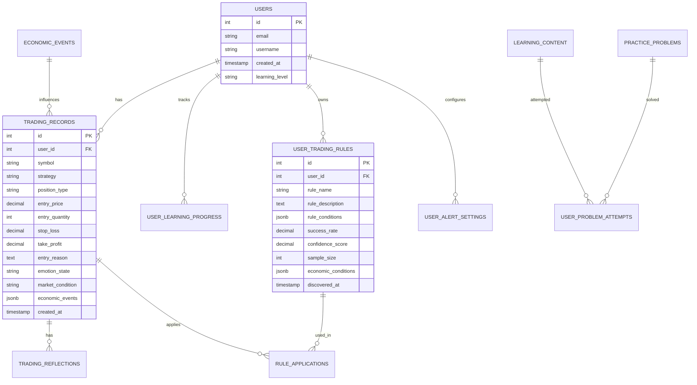

# 🏗️ ChartTeacher 시스템 설계도

> 기술적 분석 교육과 개인 매매 패턴 발견을 위한 시스템 아키텍처

## 🎯 **시스템 개요**

ChartTeacher는 **기술적 분석 교육**과 **AI 기반 개인 매매 패턴 분석**을 결합한 모바일 트레이딩 교육 플랫폼입니다. 과거 데이터를 활용한 빠른 모의투자와 거시경제 데이터 연동을 통해 종합적인 매매 교육을 제공합니다.

### **핵심 아키텍처 원칙**
- **마이크로서비스 아키텍처**: 각 기능별 독립적 서비스 구성
- **실시간 데이터 처리**: WebSocket 기반 실시간 시장 데이터 처리
- **AI 기반 분석**: 기술적 + 심리적 + 거시경제 통합 분석
- **확장 가능한 구조**: 사용자 증가에 따른 수평적 확장 지원

---

## 🏗️ **전체 시스템 아키텍처**

### **시스템 구성도**


---

## 📱 **Frontend 아키텍처**

### **React Native 앱 구조**

```
📱 ChartTeacher App
├── 🎮 Trading Module
│   ├── Chart Component (TradingView)
│   ├── Trading Control Panel
│   ├── Position Management
│   └── Reflection Modal
├── 📚 Education Module
│   ├── Theory Learning
│   ├── Practice Problems
│   ├── Tutorial System
│   └── Progress Tracking
├── ⚡ Speed Quiz Module
│   ├── Quick Trading
│   ├── Pattern Recognition
│   └── Rapid Feedback
├── 📝 Records Module
│   ├── Trading History
│   ├── Performance Analytics
│   └── AI Rules Display
├── 🤖 AI Analysis Module
│   ├── Pattern Visualization
│   ├── Personal Rules
│   └── Alert Settings
└── 👥 Community Module
    ├── Leaderboard
    ├── Strategy Sharing
    └── Discussion Forum
```

### **상태 관리 (Redux Toolkit)**

```typescript
// Store 구조
interface RootState {
  auth: AuthState;
  trading: TradingState;
  education: EducationState;
  ai: AIAnalysisState;
  community: CommunityState;
  alerts: AlertState;
}

// 핵심 상태
interface TradingState {
  currentPosition: Position | null;
  chartData: CandleData[];
  tradingHistory: TradingRecord[];
  simulationState: SimulationState;
}

interface EducationState {
  currentLesson: Lesson | null;
  progress: LearningProgress;
  problemHistory: ProblemAttempt[];
}
```

---

## 🌐 **Backend 아키텍처**

### **FastAPI 서비스 구조**

```python
# 프로젝트 구조
backend/
├── app/
│   ├── api/
│   │   ├── v1/
│   │   │   ├── trading.py      # 매매 관련 API
│   │   │   ├── education.py    # 교육 관련 API
│   │   │   ├── ai_analysis.py  # AI 분석 API
│   │   │   ├── alerts.py       # 알람 관련 API
│   │   │   └── community.py    # 커뮤니티 API
│   ├── core/
│   │   ├── config.py          # 설정 관리
│   │   ├── security.py        # 인증/보안
│   │   └── database.py        # DB 연결
│   ├── services/
│   │   ├── trading_engine.py  # 매매 엔진
│   │   ├── education_system.py # 교육 시스템
│   │   ├── ai_analyzer.py     # AI 분석 엔진
│   │   └── alert_service.py   # 알람 서비스
│   ├── models/               # SQLAlchemy 모델
│   ├── schemas/             # Pydantic 스키마
│   └── utils/               # 유틸리티 함수
```

### **핵심 서비스 설계**

#### **1. Trading Engine**
```python
class TradingEngine:
    """매매 시뮬레이션 엔진"""
    
    async def execute_trade(self, trade_request: TradeRequest) -> TradeResult:
        """매매 실행"""
        # 1. 입력 검증 (매매 이유, 손절/익절가 등)
        # 2. 포지션 생성
        # 3. 거시경제 이벤트 자동 태깅
        # 4. 데이터베이스 저장
        
    async def check_liquidation(self, position: Position) -> LiquidationResult:
        """5분 데이터 기반 자동 청산 체크"""
        # 1. 5분 데이터 조회
        # 2. 손절/익절 터치 여부 확인
        # 3. 동시 터치 시 익절 우선 처리
        
    async def simulate_candle_progression(self, symbol: str, timeframe: str):
        """캔들 진행 시뮬레이션"""
        # 1. 다음 캔들 데이터 로드
        # 2. 포지션 청산 체크
        # 3. 클라이언트에 업데이트 전송
```

#### **2. Education System**
```python
class EducationSystem:
    """교육 시스템"""
    
    async def get_learning_content(self, category: str, level: str) -> List[Content]:
        """학습 콘텐츠 조회"""
        
    async def generate_practice_problem(self, user_level: str) -> PracticeProblem:
        """개인화된 연습 문제 생성"""
        
    async def evaluate_answer(self, problem_id: int, user_answer: dict) -> Evaluation:
        """답안 평가 및 피드백 제공"""
        
    async def update_progress(self, user_id: int, lesson_id: str, score: int):
        """학습 진도 업데이트"""
```

#### **3. AI Analysis Engine**
```python
class AIAnalyzer:
    """AI 패턴 분석 엔진"""
    
    async def analyze_trading_patterns(self, user_id: int) -> List[TradingRule]:
        """개인 매매 패턴 분석"""
        # 1. 매매 기록 수집 (최소 50건)
        # 2. 기술적 패턴 분석
        # 3. 심리적 패턴 분석 (감정, 시장상황)
        # 4. 거시경제 환경 분석
        # 5. 성공 규칙 도출
        
    async def calculate_rule_confidence(self, rule: TradingRule) -> float:
        """규칙 신뢰도 계산"""
        
    async def visualize_patterns(self, user_id: int) -> PatternVisualization:
        """패턴 시각화 데이터 생성"""
```

#### **4. Alert Service**
```python
class AlertService:
    """실시간 알람 서비스"""
    
    async def monitor_market_conditions(self):
        """실시간 시장 모니터링"""
        # WebSocket으로 시장 데이터 수신
        
    async def check_user_patterns(self, user_id: int, market_data: MarketData):
        """사용자 패턴 매칭"""
        # 개인 규칙과 현재 시장 상황 비교
        
    async def send_alert(self, user_id: int, alert: Alert):
        """알람 발송"""
        # Push notification 발송
```

---

## 💾 **데이터베이스 설계**

### **핵심 테이블 관계도**



### **데이터 플로우**

#### **매매 실행 플로우**


#### **AI 분석 플로우**


---

## 🔄 **실시간 데이터 처리**

### **WebSocket 아키텍처**

```python
# WebSocket 연결 관리
class ConnectionManager:
    def __init__(self):
        self.active_connections: List[WebSocket] = []
        self.user_connections: Dict[int, WebSocket] = {}
    
    async def connect(self, websocket: WebSocket, user_id: int):
        await websocket.accept()
        self.active_connections.append(websocket)
        self.user_connections[user_id] = websocket
    
    async def broadcast_market_update(self, data: MarketData):
        """시장 데이터 브로드캐스트"""
        for connection in self.active_connections:
            await connection.send_json(data.dict())
    
    async def send_personal_alert(self, user_id: int, alert: Alert):
        """개인 알람 발송"""
        if user_id in self.user_connections:
            await self.user_connections[user_id].send_json(alert.dict())
```

### **실시간 처리 플로우**


---

## 🔐 **보안 아키텍처**

### **인증 및 권한 관리**

```python
# JWT 기반 인증
class SecurityManager:
    def create_access_token(self, user_id: int) -> str:
        """액세스 토큰 생성"""
        
    def verify_token(self, token: str) -> Optional[int]:
        """토큰 검증"""
        
    def hash_password(self, password: str) -> str:
        """비밀번호 해싱"""
        
    def verify_password(self, password: str, hashed: str) -> bool:
        """비밀번호 검증"""
```

### **데이터 보안**

- **암호화**: 민감한 매매 정보 AES-256 암호화
- **API 보안**: Rate limiting, Input validation
- **데이터베이스**: Connection pooling, SQL injection 방지
- **개인정보**: GDPR 준수, 데이터 익명화

---

## 📊 **모니터링 및 로깅**

### **시스템 모니터링**

```python
# 성능 모니터링
class PerformanceMonitor:
    def track_api_response_time(self, endpoint: str, duration: float):
        """API 응답 시간 추적"""
        
    def track_database_query_time(self, query: str, duration: float):
        """DB 쿼리 시간 추적"""
        
    def track_user_behavior(self, user_id: int, action: str, metadata: dict):
        """사용자 행동 추적"""
```

### **핵심 메트릭**

- **시스템 성능**: API 응답 시간, DB 쿼리 성능, 메모리 사용률
- **사용자 행동**: 세션 시간, 기능별 사용률, 이탈 지점
- **비즈니스 메트릭**: 매매 이유 기록률, 학습 완료율, AI 규칙 생성률
- **알람 성능**: 알람 정확도, 사용자 만족도, 응답률

---

## 🚀 **배포 및 인프라**

### **컨테이너화 (Docker)**

```dockerfile
# Backend Dockerfile
FROM python:3.11-slim
WORKDIR /app
COPY requirements.txt .
RUN pip install -r requirements.txt
COPY . .
CMD ["uvicorn", "app.main:app", "--host", "0.0.0.0", "--port", "8000"]
```

### **인프라 구성**

```yaml
# docker-compose.yml
version: '3.8'
services:
  backend:
    build: ./backend
    ports:
      - "8000:8000"
    environment:
      - DATABASE_URL=postgresql://user:pass@db:5432/chartteacher
      - REDIS_URL=redis://redis:6379
    depends_on:
      - db
      - redis
  
  db:
    image: postgres:14
    environment:
      - POSTGRES_DB=chartteacher
      - POSTGRES_USER=user
      - POSTGRES_PASSWORD=pass
    volumes:
      - postgres_data:/var/lib/postgresql/data
  
  redis:
    image: redis:7-alpine
    ports:
      - "6379:6379"
  
  nginx:
    image: nginx:alpine
    ports:
      - "80:80"
      - "443:443"
    volumes:
      - ./nginx.conf:/etc/nginx/nginx.conf
```

---

## 📈 **확장성 고려사항**

### **수평적 확장**

- **로드 밸런싱**: Nginx를 통한 요청 분산
- **데이터베이스 샤딩**: 사용자별 데이터 분산
- **캐시 전략**: Redis 클러스터링
- **마이크로서비스**: 기능별 독립적 확장

### **성능 최적화**

- **데이터베이스 인덱싱**: 자주 조회되는 컬럼 인덱스 생성
- **쿼리 최적화**: N+1 문제 해결, 배치 처리
- **캐싱 전략**: 자주 조회되는 데이터 Redis 캐싱
- **CDN 활용**: 정적 자원 배포 최적화

---

## 🎯 **개발 단계별 구현 계획**

### **Phase 1: 핵심 매매 시스템 (4주)**
1. **Week 1**: 기본 인프라 구축 (DB, API 기본 구조)
2. **Week 2**: TradingView 차트 통합, 매매 실행 로직
3. **Week 3**: 자동 청산 시스템, 매매 기록 저장
4. **Week 4**: 학습 플로우, 매매 회고 시스템

### **Phase 2: 교육 시스템 + AI 분석 (4주)**
1. **Week 1**: 교육 콘텐츠 관리 시스템
2. **Week 2**: 실전 예시 문제 시스템
3. **Week 3**: AI 패턴 분석 엔진 기본 구현
4. **Week 4**: 개인 규칙 생성 및 시각화

### **Phase 3: 고도화 + 소셜 (4주)**
1. **Week 1**: 실시간 알람 서비스
2. **Week 2**: 스피드 퀴즈 시스템
3. **Week 3**: 커뮤니티 기능 (리더보드, 공유)
4. **Week 4**: 성능 최적화 및 배포

---

**🎯 이 시스템 설계도는 ChartTeacher의 완전한 기술적 청사진입니다. 앱정의서의 모든 요구사항을 반영하여 확장 가능하고 안정적인 시스템 구조를 제시합니다. 기술자가 이를 바탕으로 단계별 개발을 진행할 수 있도록 구체적인 구현 방향과 기술 스택을 제공합니다.** 🚀 